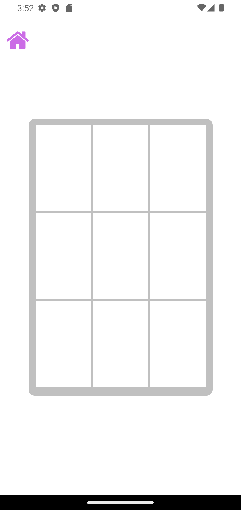
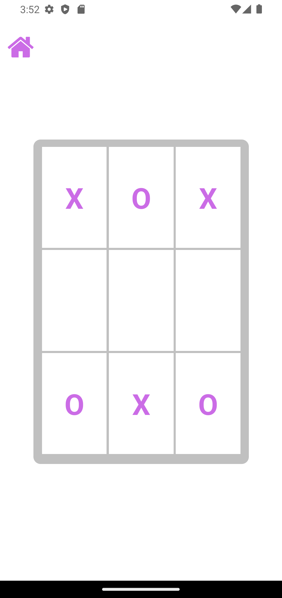

# Tic Tac Toe Game

This project is a simple game that reproduces a classical Tic Tac Toe in a Mobile version

The game will be published in the Google Play Store

# Running 

- First run "npm install" command to install the dependencies

- Lastly run "npx expo start" or "npm start" on the terminal to start

# Project Screenshots

  <figure style="text-align:center; flex:1;">
    
  </figure>
  <figure style="text-align:center; flex:1;">
      
  </figure>
  <figure style="text-align:center; flex:1;">
      
  </figure>
  <figure style="text-align:center; flex:1;">
      
  </figure>

##### Developed by ML Development Team (Matheus Letra)